# nagano-cake
**ECサイト 未実装部分あり**

ケーキ屋のECサイト

ユーザー機能、商品の注文、カート機能、履歴など

管理者機能、ジャンル編集、商品編集、注文・製作ステータス更新、ユーザー編集など

## Images
- User
<p align="center">
  
  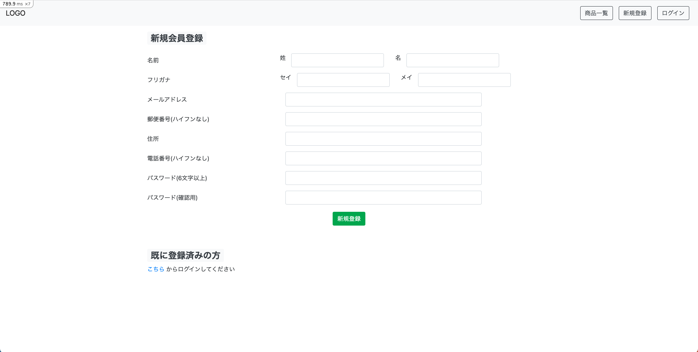
  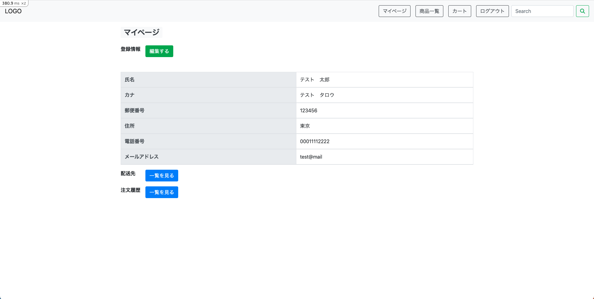
  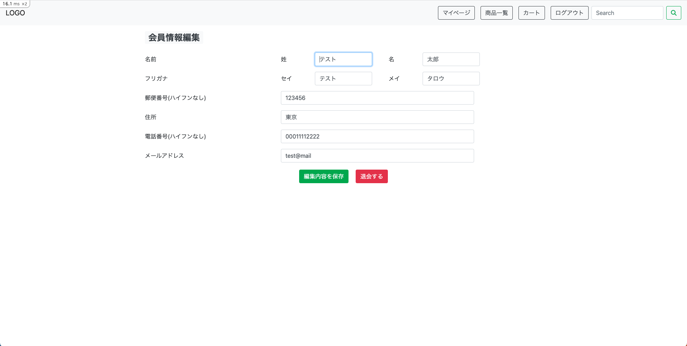
  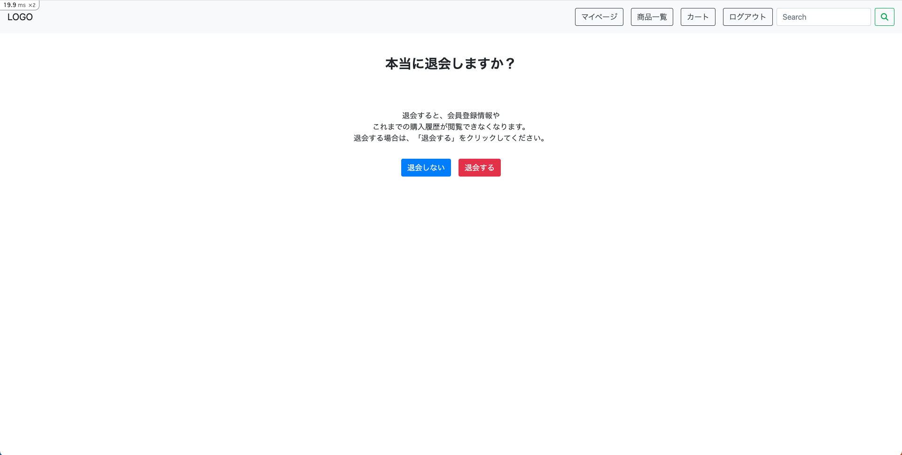
  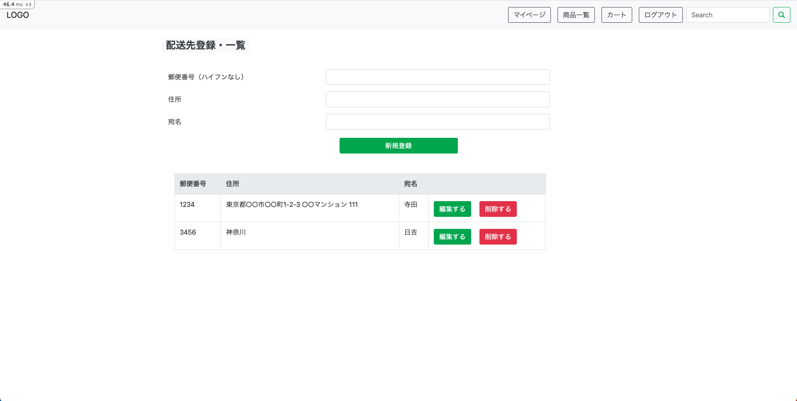
  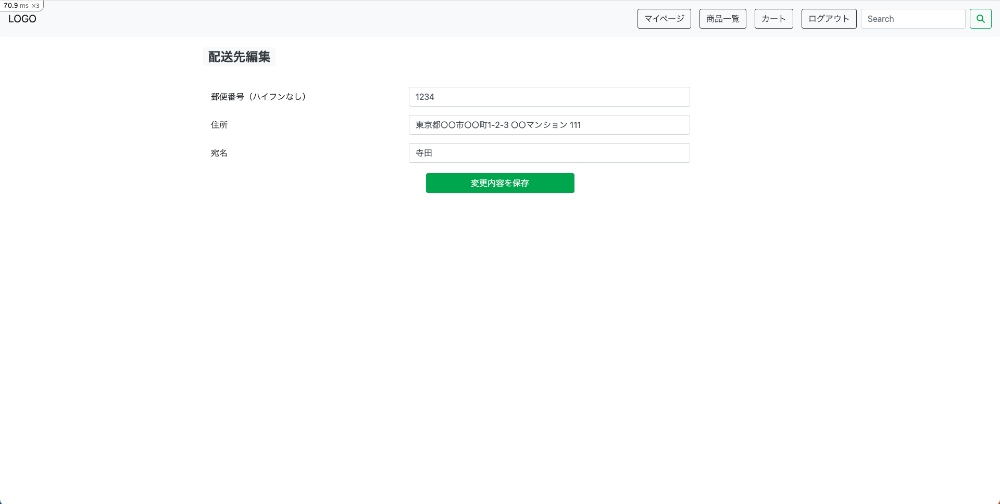
  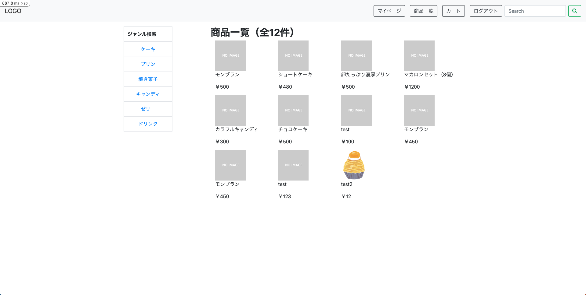
  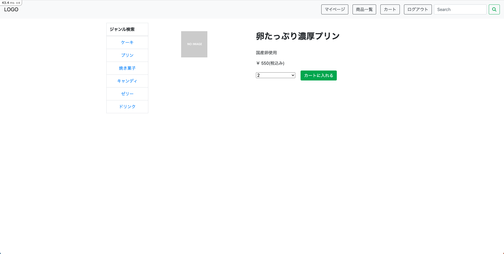
  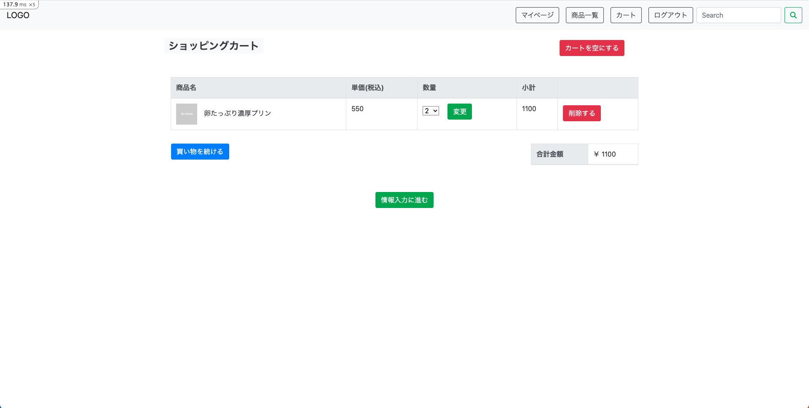
  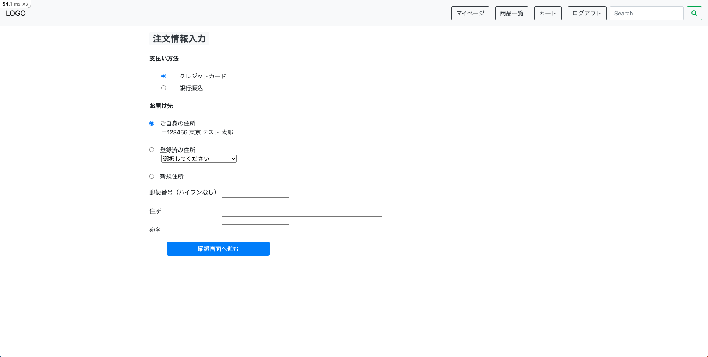
  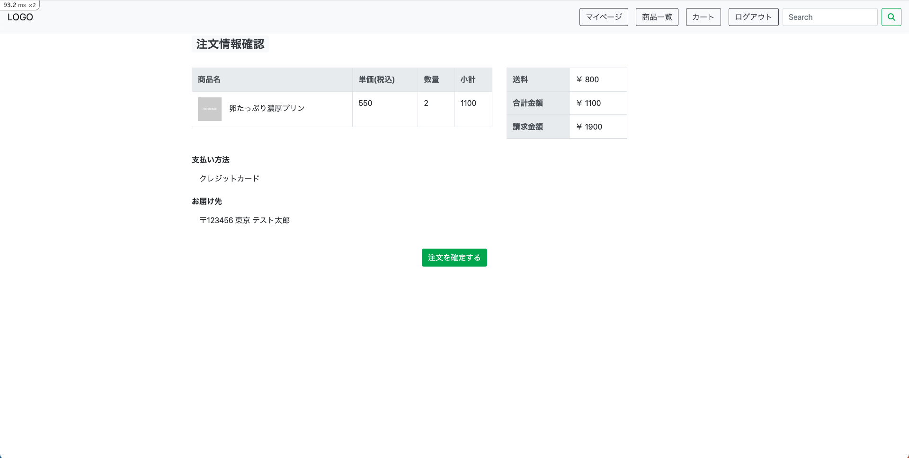
</p>

- Admin
<p align="center">
  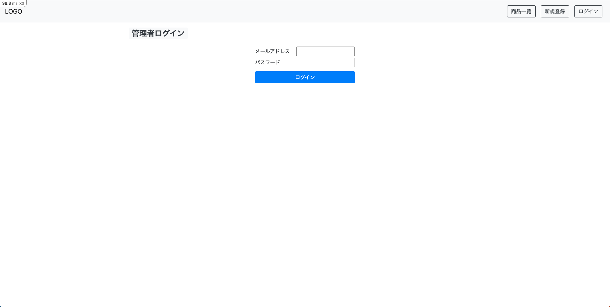
  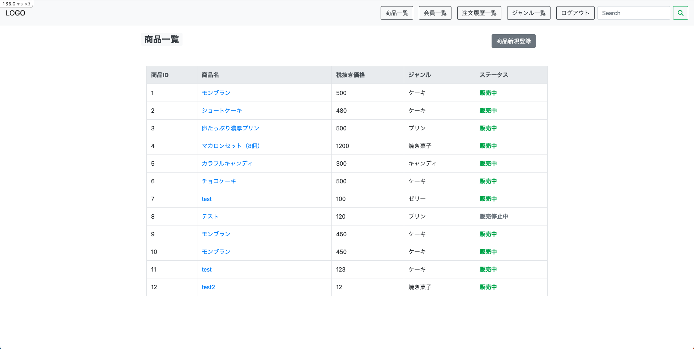
  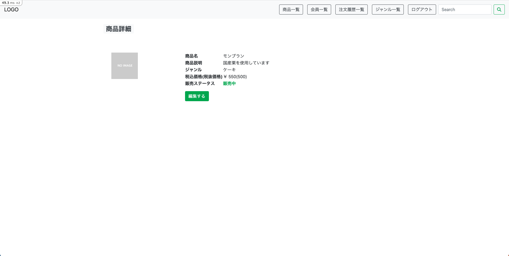
  
  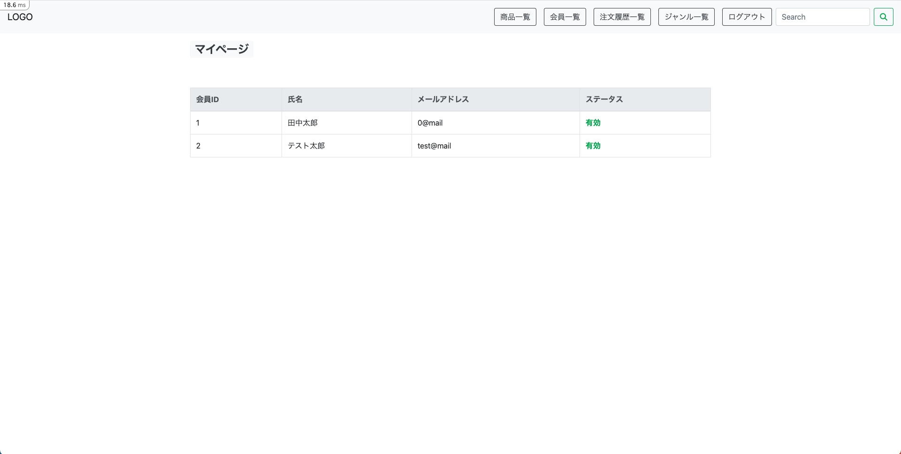
  
  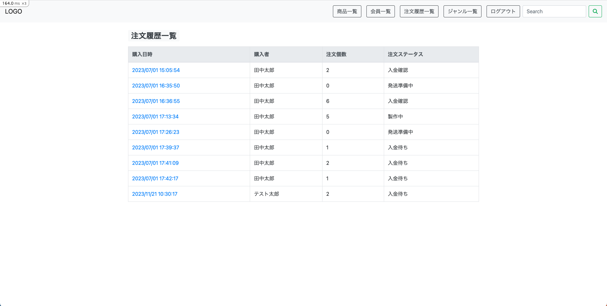
  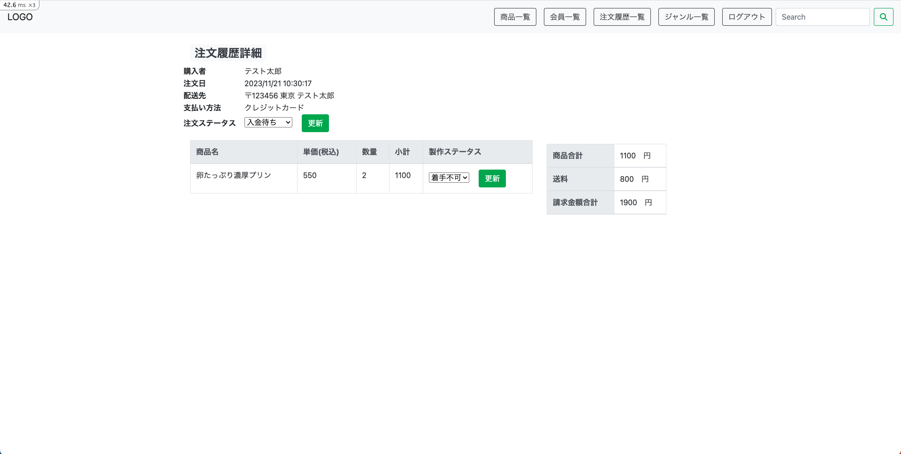
</p>

## 使用方法
- 一般ユーザー
  - 新規登録を行ってからログイン
- 管理者
  - .../adminにアクセスし、管理者アドレスとパスワードでログイン
```
email: "test@mail"
password: "123456"
```

## Usage
```
$ bundle install
$ rails webpacker:install (when asked, answer Y)
$ rails webpacker:compile
$ rails db:migrate
$ rails db:seed
```
```
$ rails s
```
If "Webpacker::Manifest::MissingEntryError" occur
```
$ yarn add @babel/plugin-proposal-private-methods @babel/plugin-proposal-private-property-in-object
```

## Version
※2023/07/01　時点
- Rails 6.1.7.3
- ruby 3.1.2p20 (2022-04-12 revision 4491bb740a) [x86_64-linux]
- node v16.19.0
- yarn 1.22.19
- Version: ImageMagick 7.1.1-5 Q16-HDRI x86_64 92a5afcfa:20230326 https://imagemagick.org
  - Copyright: (C) 1999 ImageMagick Studio LLC
  - License: https://imagemagick.org/script/license.php
  - Features: Cipher DPC HDRI OpenMP(4.5)
  - Delegates (built-in): jng jpeg lzma png tiff xml zlib
  - Compiler: gcc (7.3)
- sqlite3 3.42.0
